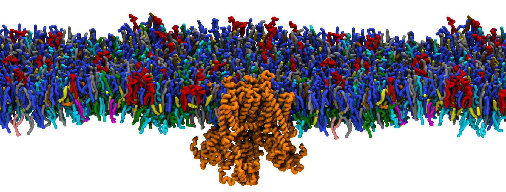
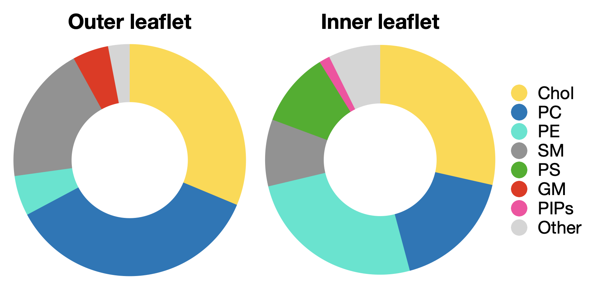

# Kv7.4 channel in plasma membrane model

Simulations of the Kv7.4 channel in a plasma membrane model with [Martini 2.2 parameters](http://cgmartini.nl/index.php/224-m22) and the [GROMACS simulation program](https://www.gromacs.org). 

Lipid composition is based on the plasma membrane model of [Ingólfsson et al. (2014)](https://pubs.acs.org/doi/full/10.1021/ja507832e)

