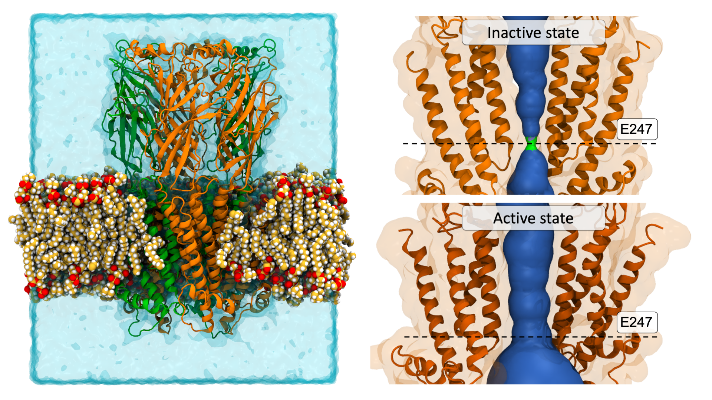

# Kv7.4 channel in plasma membrane model

Simulations of the Kv7.4 channel in a plasma membrane model with [Martini 2.2 parameters](http://cgmartini.nl/index.php/224-m22) and the [GROMACS simulation program](https://www.gromacs.org).

Lipid composition is based on the plasma membrane model of [Ingólfsson et al. (2014)](https://pubs.acs.org/doi/full/10.1021/ja507832e)

Studying how the protein interacts with the lipids and membrane biophysical properties.

 

# Binding of Sansanmycin analogues to the MurX enzyme 

Simulations to investigate the binding of Sansanmycin antibiotic analogues to the MurX enzyme from *Mycobacterium tuberculosis*\
Yellow represents a hydrophobic patch of residues that is targetted by the Sansanmycin analogues. [Find out more here](https://pubs.acs.org/doi/abs/10.1021/acs.jmedchem.1c01407).

 

# Steered molecular dynamics simulations of the $\alpha2\beta4$ nAChR

Simulations were conducted to open the pore of the $\alpha2\beta4$ nAChR.\
The vectors for steering were calculated based on the $\alpha7$ nAChR structures by [Noviello et al. (2021)](https://pubmed.ncbi.nlm.nih.gov/33735609/).

# Presentations:
### [3 Minute thesis presenation 2019](https://www.youtube.com/watch?v=xonUGe55gFs&ab_channel=AliK)
### [Molvis day presenation at the visualisation dome in Norrköping](https://twitter.com/a_kusay/status/1641179602608431105)
